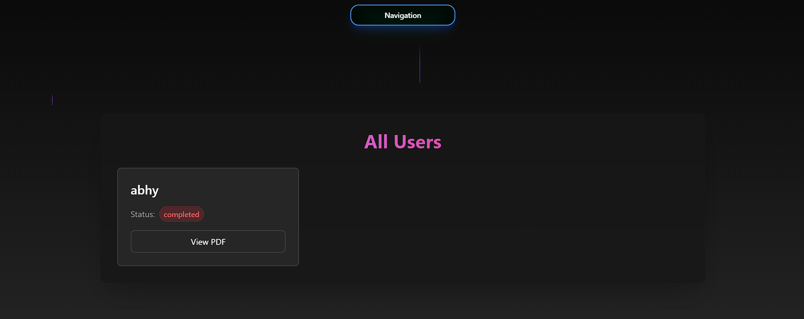

# Patronus Project

This is a Django project named Patronus.

## Getting Started

Follow these instructions to set up and run the project on your local machine for development and testing purposes.

### Prerequisites

Ensure you have the following installed on your machine:

- Docker 

### Installation

1. **Clone the repository:**

    ```bash
    git clone https://github.com/ABHYUDAYATIWARI/patronus
    cd patronus
    ```

### Docker Setup 

1. **Build and run the Docker containers:**

    ```bash
    docker-compose up --build
    ```

2. **Access the application:**

    Open your browser and navigate to `http://localhost:8000` for the backend and `http://localhost:3000` for the frontend.

### Acknowledgments

- [Django](https://www.djangoproject.com/)
- [Next.js](https://nextjs.org/)
- [Docker](https://www.docker.com/)

### Some Screenshots 
- Homepage


- All user Page
